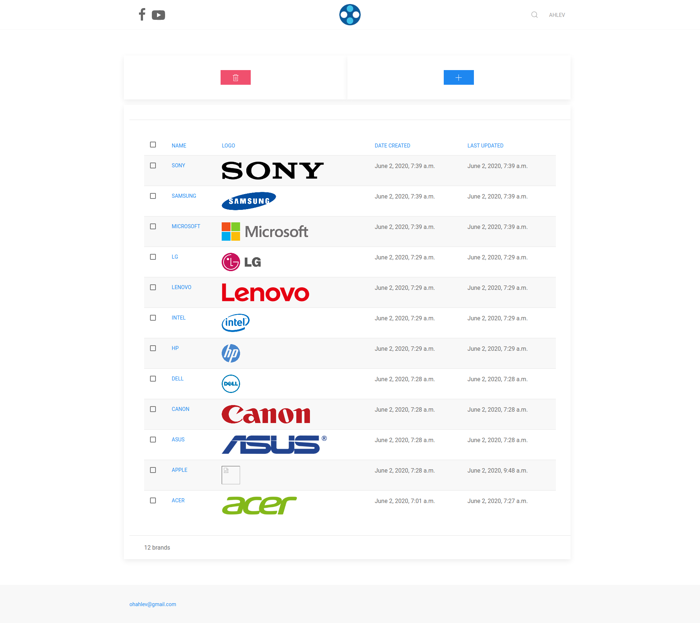
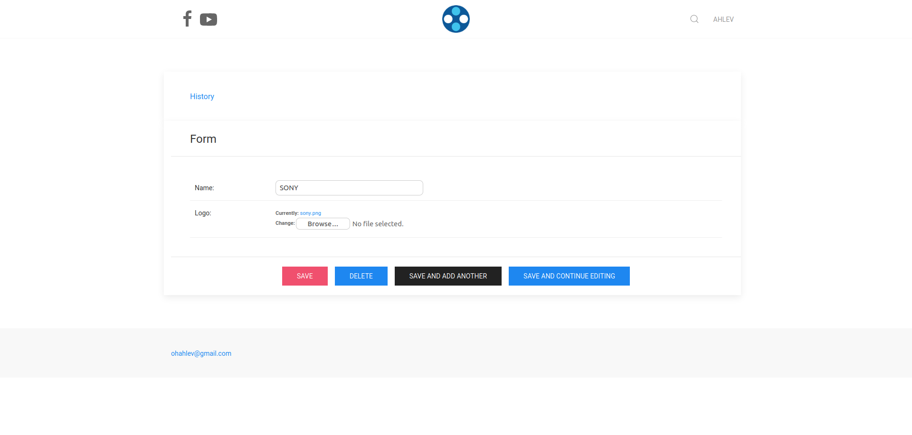
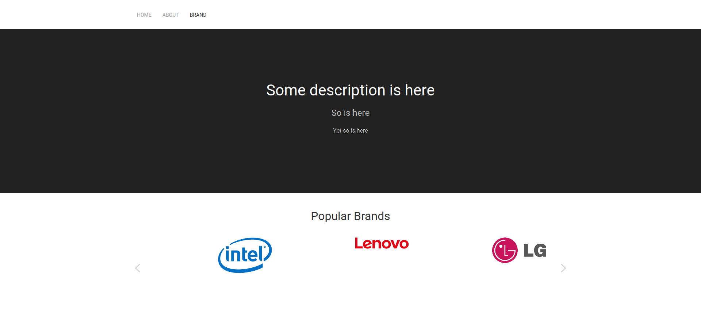

# A Brand Application
 

## install from this repository
### clone

> git clone https://github.com/ohahlev/ahlev_django_brand.git

### go to directory ahlev_django_brand

> cd ahlev_django_brand

### create installer package

> make package

### install package

cd into project directory

> cd ../my_project_dir

install ahlev_django_brand from the project directory

> pip install ../ahlev_django_brand/dist/ahlev_django_brand-0.0.1.tar.gz

## install from pypi
[ahlev_django_brand](https://pypi.org/project/ahlev_django_brand/)

## project configuration
### add ahlev_django_brand to settings.py

    INSTALLED_APPS = [
      'ahlev_django_brand',  # add this line
      'ahlev_django_uikit',  # add this line
      ...
    ]

### make sure these lines exist in settings.py

    STATICFILES_DIRS = [
      os.path.join(BASE_DIR, "static")
    ]
    STATIC_URL = '/static/'
    MEDIA_ROOT = os.path.join(BASE_DIR, 'uploads')
    MEDIA_URL = '/medias/'

### make sure these lines exists in urls.py

    # replace tmp with application name
    from django.contrib import admin
    from django.conf import settings
    from django.conf.urls.static import static
    from django.urls import include, path

    urlpatterns = [
       path('brand/', include('brand.urls')),
       path('admin/', admin.site.urls),
    ] + static(settings.MEDIA_URL, document_root=settings.MEDIA_ROOT)

## screenshots
### dashboard

### list

### edit

### brands
